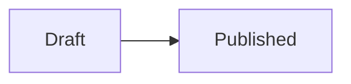

# Syntax Reference

kiln supports CommonMark and GitHub Flavored Markdown with the authoring extensions below. Theme rendering contracts are covered in [Theming](themes.md).

## Frontmatter

Content starts with TOML frontmatter between `+++` delimiters. See the [frontmatter reference](content.md#frontmatter) for fields, dates, tags and pinning.

## Pandoc-Style Attributes

A `{...}` attribute block is the shared syntax kiln uses to attach metadata to images, fenced code blocks, and directives. Each consumer recognizes its own keys and interprets bare words as described below.

The block accepts four token kinds, in any order:

| Token       | Meaning                                                          |
| ----------- | ---------------------------------------------------------------- |
| `#id`       | HTML `id`. First wins if duplicates appear, later `#id`s ignored |
| `.class`    | CSS class. Multiple `.class` tokens accumulate                   |
| `key=value` | Key-value pair. Value can be quoted (`key="..."`) or bare        |
| `bare_word` | Standalone word. Interpretation depends on the consumer          |

Quoted values support `\"` (escaped quote) and `\\` (escaped backslash).

Bare words are interpreted differently by each consumer:

| Consumer   | Bare-word meaning                                                |
| ---------- | ---------------------------------------------------------------- |
| Code fence | Boolean flag (`collapse`, `expand`)                              |
| Directive  | Positional argument (surfaced to templates as `positional_args`) |
| Image      | Ignored                                                          |

See the corresponding sections for the specific keys each consumer recognizes:

- [Image Attributes](#image-attributes)
- [Fence Attributes](#fence-attributes)
- [Directives](#directives)

## Markdown

### Headings

Headings automatically receive `id` attributes generated from their text, suitable for linking:

```markdown
## Getting Started

<!-- renders as: <h2 id="getting-started">Getting Started</h2> -->
```

The slugification algorithm is CJK-aware and preserves Chinese / Japanese / Korean characters in IDs. Alphanumerics are lowercased, `+`, `.`, `_`, and `~` survive as-is (so `C++` becomes `c++`), and every other character collapses into a single `-`. Duplicate IDs are disambiguated with numeric suffixes (`-1`, `-2`, ...).

Explicit heading IDs override the auto-generated one:

```markdown
## My Section {#custom-id}

<!-- renders as: <h2 id="custom-id">My Section</h2> -->
```

Heading IDs are unique across the page body and nested directives. Repeated IDs receive numeric suffixes in rendered document order (`name`, `name-1`, `name-2`). Authored IDs are reserved before generated heading and footnote IDs are allocated.

Headings are also collected into a structured table of contents, exposed to post templates as the `toc` variable. See [Post templates](themes.md#post-templates-posthtml).

Set `heading_numbering = true` in frontmatter to number headings and table-of-contents links, starting at `1`. A heading's `{numbering-start=0}` starts its local level at `0`, giving `2.0` under chapter `2`.

### Images

Standard Markdown image syntax is supported. kiln distinguishes between **block** and **inline** images:

#### Block image

A paragraph containing only a single image:

```markdown

```

Renders as a `<figure>` with `<figcaption>` (from the alt text). Images receive `loading="lazy"` automatically.

#### Inline image

An image appearing alongside other text in a paragraph:

```markdown
Here is an icon  in the middle of text.
```

Renders as an img, optionally wrapped for a loading placeholder. See [Image Rendering](themes.md#image-rendering) for the theme contract.

#### Image Attributes

A [Pandoc-style attribute block](#pandoc-style-attributes) can follow the closing `)` to set id, classes, width, and height:

```markdown
{#hero .wide width=800 height=600}
```

The block must appear immediately after the image syntax. Recognized keys:

| Key      | Target (block) | Target (inline) |
| -------- | -------------- | --------------- |
| `#id`    | `<figure>`     | ``         |
| `.class` | `<figure>`     | ``         |
| `width`  | ``        | ``         |
| `height` | ``        | ``         |

### Syntax Highlighting

Fenced code blocks with a language tag receive syntax highlighting via [syntect](https://github.com/trishume/syntect) + [two-face](https://github.com/CosmicHorrorDev/two-face) (bat's 200+ language syntax definitions):

````markdown
```rust
fn main() {
    println!("Hello, world!");
}
```
````

Features:

- CSS-class-based highlighting without inline styles, which requires a syntect theme stylesheet.
- Line numbers are included automatically.
- Language labels are canonicalized from syntax definitions (e.g., `rs` maps to `rust`).
- Unrecognized languages fall back to plain text.

Blocks use native disclosure and start open unless `collapse` is set. The site setting `params.code_max_lines` limits visible lines when supported by the theme. See [the code-block contract](themes.md#code-blocks) for styling hooks.

#### Fence Attributes

A [Pandoc-style attribute block](#pandoc-style-attributes) can follow the language tag to refine a fenced code block:

````markdown
```rust {#example .compact title="src/main.rs" highlight="1,3-5" collapse}
fn main() {
    println!("Hello, world!");
}
```
````

Recognized keys:

| Key                 | Effect                                                                               |
| ------------------- | ------------------------------------------------------------------------------------ |
| `#id`               | Sets the `id` attribute on the wrapper `<details class="code-block">`                |
| `.class`            | Appends additional CSS classes to the wrapper                                        |
| `title="..."`       | Renders a `<span class="code-title">` in place of the language pill                  |
| `highlight="1,3-5"` | Comma-separated lines / ranges to mark with `class="line hl"` (and `line-number hl`) |

Bare flags:

| Flag       | Effect                                                                           |
| ---------- | -------------------------------------------------------------------------------- |
| `collapse` | Forces the block into the collapsed state regardless of the site default         |
| `expand`   | Forces the block into the expanded state, suppressing any `code_max_lines` clamp |

Either flag wins over the site-level `code_max_lines` default. The language tag is preserved on `data-lang` for syntax CSS even when a `title` is set.

### Math (KaTeX)

Inline math uses single dollar signs, display math uses double:

```markdown
Inline: $E = mc^2$

Display:

$$
\int_0^\infty e^{-x^2} dx = \frac{\sqrt{\pi}}{2}
$$
```

Math expressions render as KaTeX-compatible markup (`<span class="math math-inline">` / `<span class="math math-display">`). Themes load the [KaTeX](https://katex.org) CSS and JS for client-side rendering by gating on `"math" in assets.features`. See [Theming](themes.md#template-variables) for the page-scoped asset registry.

### Mermaid Diagrams

Use a `mermaid` code fence:

````markdown

````

The theme must load and initialize Mermaid for pages declaring the `mermaid` feature. See [Page Assets](themes.md#page-assets).

### Footnotes

```markdown
Here is a claim[^1] that needs a source.

[^1]: The source for the claim.
```

Definitions can go anywhere within the page body or a directive body. Each body is a separate footnote scope, so references and definitions must share that scope. Labels match using Unicode case folding, and the first definition of a label is used. Unreferenced definitions are omitted.

Notes render at the end of their scope, numbered by first reference in the body. References within reachable notes follow those in the body. Each reference links to its note, and each note links back to every rendered reference. Repeated references have numbered return links.

### GFM Extensions

[GitHub Flavored Markdown](https://github.github.com/gfm/) extensions are enabled:

#### Tables

```markdown
| Left | Center | Right |
| :--- | :----: | ----: |
| a    |   b    |     c |
```

#### Strikethrough

```markdown
~~deleted text~~
```

#### Task lists

```markdown
- [x] Completed
- [ ] Pending
```

#### Autolinks

Wrap a URL or email address in angle brackets: `<https://example.com>` or `<name@example.com>`.

## Shortcodes

Shortcodes are inline replacements. Code blocks and code spans retain their literal text.

### Emoji

When `emojis = true` is set in `[params]`, GitHub-style emoji shortcodes are replaced with Unicode characters:

```markdown
Hello :smile: and :wave:

<!-- renders as: Hello 😄 and 👋 -->
```

Unknown shortcodes (e.g., `:not_a_real_emoji:`) are left as-is. See the [GitHub emoji list](https://github.com/ikatyang/emoji-cheat-sheet) for supported shortcodes.

### Font Awesome Icons

When `fontawesome = true` is set in `[params]`, icon shortcodes produce `<i>` elements:

```markdown
:(fas fa-link): Click here :(fab fa-github):

<!-- renders as: <i class="fas fa-link" aria-hidden="true"></i> Click here <i class="fab fa-github" aria-hidden="true"></i> -->
```

The class inside `:(...):` is passed to the `class` attribute of the `<i>` element. The page template must include the [Font Awesome](https://fontawesome.com) CSS for icons to display.

## Directives

Directives use `:::` fenced blocks (similar to [Pandoc fenced divs](https://pandoc.org/MANUAL.html#divs-and-spans)). They provide structured content blocks beyond standard Markdown.

### Basic Syntax

A directive block starts at the beginning of a line with three or more colons followed by an optional directive name, and ends with a matching (or longer) colon fence:

```markdown
::: callout
This is a note.
:::
```

A [Pandoc-style attribute block](#pandoc-style-attributes) can follow the directive name. Bare words inside `{...}` become positional arguments accessible in templates as `positional_args`:

```markdown
::: callout {#my-id .custom-class type=tip title="Read This"}
Content here.
:::
```

### Nesting

Directives can be nested by using more colons for the outer fence:

```markdown
:::: callout {type=warning}
::: callout {type=tip}
This tip is inside a warning.
:::
More warning content.
::::
```

The closing fence must have at least as many colons as the opening fence it closes. A `:::` fence cannot close a `::::` block, but a `::::` fence can close a `:::` block.

### Code Blocks Inside Directives

Fenced code blocks inside directives work normally. The parser is aware of code fences and will not interpret `:::` inside a code block as a directive boundary:

<!-- dprint-ignore -->
````markdown
::: callout
Here is an example:

```python
print("Hello")
```

:::
````

### Callouts

Callouts are styled content blocks. The `callout` directive supports 12 types:

| Type       | Default Title |
| ---------- | ------------- |
| `abstract` | Abstract      |
| `bug`      | Bug           |
| `danger`   | Danger        |
| `example`  | Example       |
| `failure`  | Failure       |
| `info`     | Info          |
| `note`     | Note          |
| `question` | Question      |
| `quote`    | Quote         |
| `success`  | Success       |
| `tip`      | Tip           |
| `warning`  | Warning       |

Callouts use native disclosure. Theme styling hooks are documented under [Callouts and Divs](themes.md#callouts-and-divs).

#### Type and Options

The callout type defaults to `note`. Use `type=` to specify a different type. Custom titles and collapse behavior are set via key-value attributes:

```markdown
::: callout {type=warning title="Careful" open=false}
This warning starts collapsed.
:::
```

Recognized keys:

| Key     | Values           | Default | Description                              |
| ------- | ---------------- | ------- | ---------------------------------------- |
| `type`  | see table above  | `note`  | Callout type (determines icon and style) |
| `title` | any string       | none    | Overrides the default title              |
| `open`  | `true` / `false` | `true`  | Controls whether the `<details>` is open |

### Generic Div Wrappers

An unnamed directive applies authored IDs and classes to a div:

<!-- dprint-ignore -->
```markdown
::: {.compact-table}
| A | B |
| --- | --- |
| 1 | 2 |
:::
```

If a named directive has no matching template, it also becomes a div and adds its name as a class.

### Template-Based Directives

Themes can provide custom directive renderers as MiniJinja templates at `templates/directives/<name>.html`. A matching template controls the rendered output:

```markdown
::: site
https://example.com
:::
```

If `templates/directives/site.html` exists, kiln renders it with the [directive template variables](themes.md#directive-templates-directivesnamehtml).

#### Directive Arguments

Arguments inside `{...}` (after `#id` and `.class` extraction) are split into **positional** and **named** components, exposed to templates as `positional_args` and `named_args`:

| Input form        | Example            | Result                      |
| ----------------- | ------------------ | --------------------------- |
| `"quoted string"` | `"scores.csv"`     | Positional: `"scores.csv"`  |
| `bare_word`       | `inline`           | Positional: `"inline"`      |
| `key="value"`     | `server="example"` | Named: `server → "example"` |
| `key=value`       | `cols=3`           | Named: `cols → "3"`         |

For example, `::: music {#player .wide server="example" type="song" id="12345"}` parses to: `id="player"`, `classes=["wide"]`, and `named_args={server: "example", type: "song", id: "12345"}`.

```html
<iframe
  src="https://{{ named_args.server }}.com/embed/{{ named_args.type }}/{{ named_args.id }}"
></iframe>
```

For data-driven directives, the template-side helpers `read_file`, `parse_csv`, and `register_script` are documented under [Template Functions](themes.md#template-functions).
